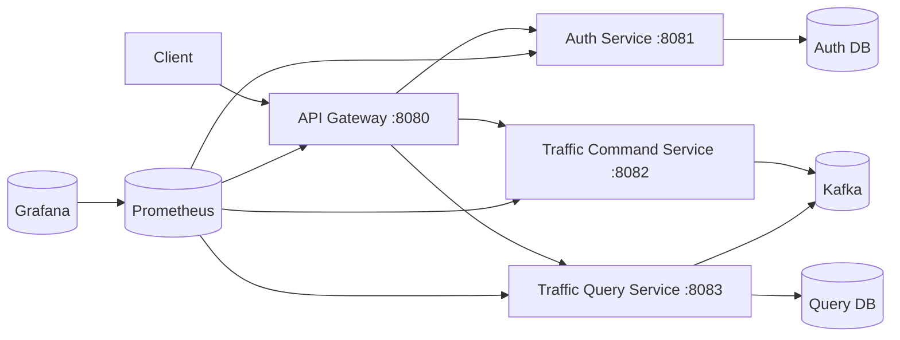

# Kotlin Spring Boot MSA 구현 A→Z

이 문서는 본 프로젝트를 **실무형 MSA 구조로 A부터 Z까지** 어떻게 구성했는지 순서대로 설명합니다.

## 아키텍처 개요

## 왜 이 앱 구조인가

- 교통 이벤트는 대량 유입/조회가 동시에 발생합니다.
- 그래서 `쓰기(Command)`와 `읽기(Query)`를 분리(CQRS)해서 확장성을 확보했습니다.
- 서비스 간 결합을 낮추기 위해 Kafka 이벤트 계약을 `shared-kernel`로 고정했습니다.

## A부터 Z까지

### A. 빌드 장애 원인 파악
- 기존 실패 원인: Gradle Toolchain이 `Java 24`로 고정되어 로컬 JDK와 불일치.
- 해결: Toolchain을 `Java 17`로 정렬해 빌드 안정화.

### B. 멀티모듈 전환
- 단일 모듈을 아래로 분리:
  - `shared-kernel`
  - `api-gateway`
  - `auth-service`
  - `traffic-command-service`
  - `traffic-query-service`

### C. 루트 Gradle 공통화
- Kotlin/JVM, 테스트(JUnit 5), Toolchain 설정을 루트에서 일관 관리.

### D. 서비스 경계 정의
- 인증, 쓰기, 읽기 책임을 물리적으로 분리.
- 게이트웨이는 오케스트레이션 없이 라우팅/추적에 집중.

### E. 공통 계약(shared-kernel) 작성
- 이벤트 계약(`TrafficEventMessage`), 응답 DTO, 공통 에러 모델 정의.

### F. 분산 추적 헤더 표준화
- `X-Trace-Id`를 서비스 공통 헤더로 채택.
- 게이트웨이 진입 시 생성/보정 후 전파.

### G. API Gateway 구현
- 외부 단일 진입점 제공.
- 인증/수집/조회 API를 각 서비스로 프록시 전달.

### H. Gateway 라우팅/프록시 계층 분리
- Controller는 HTTP 입출력만 담당.
- 실제 전달은 `GatewayProxyService`에 위임.

### I. 인증 서비스 골격 구현
- 회원가입/로그인/토큰검증 API 구성.

### J. JWT 보안 구성
- `jjwt` 기반 토큰 발급/검증 구현.
- 만료 시각, issuer, secret을 설정값으로 외부화.

### K. 사용자 영속화(JPA)
- `auth-service`에 사용자 엔티티/리포지토리 구성.
- 비밀번호는 BCrypt 해시로 저장.

### L. 인증 예외 표준화
- Validation, 도메인 오류, JWT 오류를 공통 에러 포맷으로 통일.

### M. 커맨드 서비스 구현
- 교통 이벤트 수집 API 제공.
- 수집 성공 시 `202 ACCEPTED` 반환.

### N. Kafka Producer 명시 구성
- Boot 자동 구성 의존을 줄이기 위해 ProducerFactory/KafkaTemplate 명시 등록.

### O. 이벤트 발행 신뢰성 확보
- 발행 Future 완료를 짧게 대기해 실패를 즉시 감지.

### P. 쿼리 서비스 구현
- Kafka 이벤트 소비 후 조회 모델 생성.

### Q. 조회 모델 영속화(JPA)
- 원본 이벤트 테이블 + 지역 집계 테이블 분리.
- 재시작 후에도 조회 상태를 유지.

### R. 소비 멱등성 적용
- `eventId` 중복 수신 시 무시해 at-least-once 소비를 안전화.

### S. 쿼리 API 제공
- `/summary` : 지역별 집계
- `/events/recent` : 최신 이벤트 조회

### T. Kafka Consumer 명시 구성
- ConsumerFactory/ListenerContainerFactory를 직접 등록해 환경 의존성 감소.

### U. 운영 메트릭 노출
- 모든 서비스에 Actuator + Prometheus 레지스트리 적용.

### V. 컨테이너 실행 준비
- 각 서비스별 Dockerfile 작성.
- JVM 메모리 옵션 보수 설정.

### W. 운영 인프라 Compose 구성
- Kafka/Zookeeper, PostgreSQL(2개), Redis, Prometheus, Grafana 포함.

### X. 장애 대응을 위한 표준 에러 응답
- 모든 서비스가 공통 에러 구조(`ApiError`)를 반환.

### Y. 인수 테스트(실무형)
- 인증 플로우, 커맨드 발행, 쿼리 소비/조회, 게이트웨이 라우팅 시나리오 작성.

### Z. 최종 검증
- `./gradlew test`로 모듈 전체 테스트/인수 테스트 통합 통과 확인.

## 런타임 동작 방식

## 1) 인증
1. 클라이언트가 게이트웨이에 로그인 요청.
2. 게이트웨이가 Trace ID를 보장한 뒤 `auth-service`로 전달.
3. `auth-service`는 DB 사용자 검증 후 JWT 발급.

## 2) 이벤트 수집
1. 클라이언트가 게이트웨이를 통해 이벤트 수집 요청.
2. `traffic-command-service`가 이벤트를 계약 객체로 변환.
3. Kafka 토픽(`traffic.events.v1`)에 발행.

## 3) 조회
1. `traffic-query-service`가 Kafka 이벤트를 소비.
2. 이벤트 원본/집계 테이블 업데이트.
3. 클라이언트 조회 시 DB 기반으로 빠르게 응답.

## 확장 전략(실무)

- 게이트웨이 수평 확장: 무상태(Stateless) 유지로 인스턴스 증설 용이.
- 커맨드 확장: 파티션 키 설계(`eventId`/region 기반)로 Kafka 처리량 확장.
- 쿼리 확장: 읽기 복제/캐시(예: Redis) 추가 가능.
- 장애 격리: 서비스별 독립 배포/스케일링.
- 관측성: Trace ID + Prometheus + Grafana로 장애 분석 시간 단축.

## 주요 파일

- 루트 설정: `build.gradle`, `settings.gradle`
- 공통 계약: `libs/shared-kernel/src/main/kotlin/com/devbattery/infinitytraffic/shared/contract/TrafficContracts.kt`
- 게이트웨이: `services/api-gateway/src/main/kotlin/com/devbattery/infinitytraffic/gateway`
- 인증: `services/auth-service/src/main/kotlin/com/devbattery/infinitytraffic/auth`
- 커맨드: `services/traffic-command-service/src/main/kotlin/com/devbattery/infinitytraffic/command`
- 쿼리: `services/traffic-query-service/src/main/kotlin/com/devbattery/infinitytraffic/query`
- 인프라: `infra/docker-compose.yml`, `infra/prometheus/prometheus.yml`
