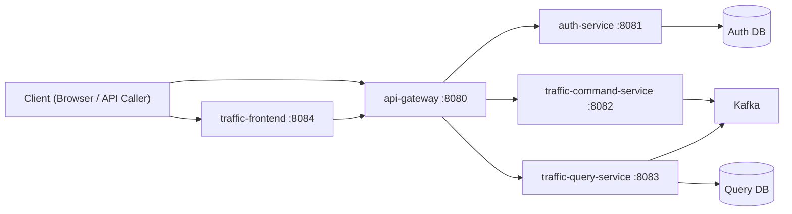

# Infinity Traffic 기술 스택 완전 학습서 (기초 → 실무 응용)

이 문서는 **"코틀린/카프카를 처음 접하는 1년차 백엔드 개발자"**를 기준으로 작성했습니다.
목표는 단순 이해가 아니라, 이 문서 하나로 **혼자서 동일한 실무형 MSA 앱을 재구현**할 수 있게 만드는 것입니다.

- 대상 프로젝트: `Infinity Traffic`
- 기준 코드 루트: `/Users/ibm/IdeaProjects/infinity-traffic`
- 설명 범위: Kotlin, Spring Boot, Gradle 멀티모듈, JWT, JPA, Flyway, Kafka, CQRS, API Gateway(WebFlux), Thymeleaf, JS, Docker Compose, 모니터링, 테스트, k6

---

## 1. 이 앱을 먼저 한 줄로 이해하기

이 앱은 "지도 서비스"가 아니라 다음을 학습/검증하기 위한 **실무형 트래픽 이벤트 플랫폼**입니다.

1. 인증 서비스(Auth)
2. 이벤트 수집(Command)
3. 이벤트 조회(Query)
4. 외부 단일 진입점(API Gateway)
5. 운영 화면(Thymeleaf Frontend)
6. 이벤트 브로커(Kafka)
7. 관측(Prometheus/Grafana)

핵심 패턴은 아래 3개입니다.

1. **MSA**: 역할별 서비스 분리
2. **CQRS**: 쓰기/읽기 경로 분리
3. **Event-Driven**: Command가 Kafka로 발행, Query가 소비해 Projection 생성

---

## 2. 전체 아키텍처와 요청/데이터 흐름



### 2.1 인증 흐름

1. 클라이언트가 `/api/auth/register`, `/api/auth/login` 호출
2. Gateway가 Auth로 전달
3. Auth가 DB/JWT 처리 후 응답

### 2.2 이벤트 수집 흐름

1. 클라이언트가 `/api/traffic/events` 호출
2. Gateway -> Command
3. Command가 `TrafficEventMessage`를 Kafka 토픽으로 발행

### 2.3 조회 흐름

1. Query 서비스가 Kafka에서 이벤트 소비
2. 이벤트 원본 + 집계 Projection DB 갱신
3. `/api/traffic/summary`, `/api/traffic/events/recent` 조회 응답

### 2.4 왜 이렇게 나누는가?

1. 읽기/쓰기 부하 특성이 다르기 때문
2. 장애 격리(수집 장애와 조회 장애 분리)
3. 팀 단위 독립 배포/스케일
4. 이벤트 기반 감사/재처리 용이

---

## 3. 로컬 개발 환경 기초

### 3.1 필수 도구

1. JDK 17+
2. Docker Desktop
3. Gradle Wrapper(`./gradlew`)
4. (선택) IntelliJ IDEA
5. (부하테스트) k6

### 3.2 포트 맵

1. `8080` Gateway
2. `8081` Auth
3. `8082` Command
4. `8083` Query
5. `8084` Frontend
6. `9094` Kafka host listener
7. `9090` Kafka UI
8. `9091` Prometheus
9. `3000` Grafana

### 3.3 가장 빠른 실행

```bash
cd /Users/ibm/IdeaProjects/infinity-traffic
./scripts/local/start-all.sh
./scripts/local/status-all.sh
```

참고 스크립트:

- `/Users/ibm/IdeaProjects/infinity-traffic/scripts/local/start-all.sh`
- `/Users/ibm/IdeaProjects/infinity-traffic/scripts/local/status-all.sh`
- `/Users/ibm/IdeaProjects/infinity-traffic/scripts/local/stop-all.sh`

---

## 4. Gradle 멀티모듈 기초 → 응용

### 4.1 멀티모듈이란?

하나의 저장소 안에 여러 모듈(라이브러리/서비스)을 두고, 공통/독립 의존성을 관리하는 구조입니다.

이 프로젝트 모듈:

1. `shared-kernel`
2. `api-gateway`
3. `auth-service`
4. `traffic-command-service`
5. `traffic-query-service`
6. `traffic-frontend`

정의 위치:

- `/Users/ibm/IdeaProjects/infinity-traffic/settings.gradle`

### 4.2 왜 `shared-kernel`이 필요한가?

Kafka 메시지 DTO를 서비스마다 복붙하면 버전 충돌이 납니다.
`TrafficEventMessage`, `ApiError` 같은 계약을 한 모듈에 고정하면 계약 불일치 위험이 크게 줄어듭니다.

계약 코드:

- `/Users/ibm/IdeaProjects/infinity-traffic/libs/shared-kernel/src/main/kotlin/com/devbattery/infinitytraffic/shared/contract/TrafficContracts.kt`

### 4.3 루트 빌드 공통화 포인트

파일:

- `/Users/ibm/IdeaProjects/infinity-traffic/build.gradle`

핵심:

1. Kotlin/Spring plugin 버전 일괄 관리
2. Java toolchain 17 고정
3. 테스트 JUnit Platform 공통 설정

### 4.4 초급자가 자주 틀리는 포인트

1. 모듈 경로와 `settings.gradle` include 불일치
2. Java 버전 불일치(toolchain 누락)
3. 공통 의존성과 모듈 의존성 책임 혼합

---

## 5. Kotlin 기초 (진짜 입문)

이 프로젝트를 읽고 쓰기 위해 필요한 Kotlin 핵심만 먼저 잡습니다.

### 5.1 `val` vs `var`

```kotlin
val username: String = "operator" // 재할당 불가
var speed: Int = 40               // 재할당 가능
```

실무 원칙:

1. 기본은 `val`
2. 변경 상태가 꼭 필요할 때만 `var`

### 5.2 data class

DTO/응답 모델에 가장 많이 씁니다.

```kotlin
// 교통 이벤트 계약 객체
// equals/hashCode/toString/copy 자동 생성

data class TrafficEventMessage(
    val eventId: String,
    val traceId: String,
    val region: String,
    val roadName: String,
    val averageSpeedKph: Int,
    val congestionLevel: Int,
    val observedAt: Instant,
)
```

실제 파일:

- `/Users/ibm/IdeaProjects/infinity-traffic/libs/shared-kernel/src/main/kotlin/com/devbattery/infinitytraffic/shared/contract/TrafficContracts.kt`

### 5.3 널 안정성

```kotlin
val region: String? = null
val normalized: String = region?.trim()?.uppercase() ?: "ALL"
```

프로젝트 예시:

- `region` query param이 없을 수 있으므로 `String?`
- `normalizeRegion`로 null/blank 보정

### 5.4 함수와 표현식

```kotlin
fun resolveTraceId(traceId: String?): String = traceId ?: TraceIdGenerator.create()
```

짧은 로직은 표현식 함수가 가독성 좋습니다.

### 5.5 컬렉션 연산

```kotlin
val avg = regions
    .map { it.averageSpeedKph }
    .average()
```

### 5.6 클래스/객체/companion

```kotlin
object TraceHeaders {
    const val TRACE_ID: String = "X-Trace-Id"
}
```

공통 상수/유틸은 `object`가 편리합니다.

### 5.7 코틀린 + 스프링에서 중요한 점

1. 생성자 주입을 기본으로 사용
2. nullable 타입으로 입력 경계 표현
3. data class로 DTO 단순화
4. 문자열 trim/정규화를 도메인 경계에서 처리

---

## 6. Spring Boot 기초 → 이 프로젝트 적용

### 6.1 핵심 개념

1. `@SpringBootApplication`: 앱 시작점
2. `@Configuration`: 빈 설정
3. `@Service`: 비즈니스 로직
4. `@RestController`: HTTP API
5. `@Repository`(JPA 인터페이스): DB 접근

### 6.2 설정값 바인딩 (`@ConfigurationProperties`)

예시 파일:

- `/Users/ibm/IdeaProjects/infinity-traffic/services/auth-service/src/main/kotlin/com/devbattery/infinitytraffic/auth/config/AuthJwtProperties.kt`

이점:

1. 하드코딩 제거
2. 환경별 설정 변경 용이
3. 테스트 주입 쉬움

### 6.3 계층 분리 원칙

1. Controller: HTTP 입출력/검증
2. Service: 유스케이스
3. Repository: 저장소
4. Config: 빈/외부 설정

### 6.4 Validation

예시(`@NotBlank`, `@Min`, `@Max`):

- `/Users/ibm/IdeaProjects/infinity-traffic/services/traffic-command-service/src/main/kotlin/com/devbattery/infinitytraffic/command/web/TrafficCommandDtos.kt`

`@Valid` + DTO 어노테이션 조합으로 요청 경계를 엄격히 만듭니다.

### 6.5 예외 표준화 (`@RestControllerAdvice`)

예시 파일:

- `/Users/ibm/IdeaProjects/infinity-traffic/services/auth-service/src/main/kotlin/com/devbattery/infinitytraffic/auth/web/AuthExceptionHandler.kt`
- `/Users/ibm/IdeaProjects/infinity-traffic/services/traffic-command-service/src/main/kotlin/com/devbattery/infinitytraffic/command/web/TrafficCommandExceptionHandler.kt`
- `/Users/ibm/IdeaProjects/infinity-traffic/services/traffic-query-service/src/main/kotlin/com/devbattery/infinitytraffic/query/web/TrafficQueryExceptionHandler.kt`

공통 에러 포맷(`ApiError`):

```json
{
  "code": "VALIDATION_ERROR",
  "message": "...",
  "traceId": "...",
  "timestamp": "..."
}
```

---

## 7. Auth 서비스: 보안 기초부터 JWT 실무까지

### 7.1 비밀번호 저장 원칙

절대 평문 저장 금지.

프로젝트는 `BCryptPasswordEncoder` 사용:

- `/Users/ibm/IdeaProjects/infinity-traffic/services/auth-service/src/main/kotlin/com/devbattery/infinitytraffic/auth/config/AuthCommonConfig.kt`
- `/Users/ibm/IdeaProjects/infinity-traffic/services/auth-service/src/main/kotlin/com/devbattery/infinitytraffic/auth/service/UserAccountService.kt`

### 7.2 JWT 기초

JWT는 `Header.Payload.Signature` 형식 문자열입니다.

1. Header: 알고리즘
2. Payload: subject(username), expiration 등 클레임
3. Signature: 비밀키 서명

프로젝트 구현:

- `/Users/ibm/IdeaProjects/infinity-traffic/services/auth-service/src/main/kotlin/com/devbattery/infinitytraffic/auth/security/JwtTokenService.kt`

### 7.3 회원가입/로그인/검증 흐름

1. 회원가입
- username 중복 확인
- 비밀번호 해시 저장

2. 로그인
- raw password와 hash 비교
- 성공 시 JWT 발급

3. 토큰 검증
- Bearer 추출
- 서명/만료 검증

Controller:

- `/Users/ibm/IdeaProjects/infinity-traffic/services/auth-service/src/main/kotlin/com/devbattery/infinitytraffic/auth/web/AuthController.kt`

### 7.4 보안 실무 포인트

1. JWT secret은 환경변수로 주입
2. 토큰 만료 시간 짧게 유지
3. 필요 시 Refresh Token 분리
4. 로그에 민감정보(비밀번호/토큰 전문) 남기지 않기

---

## 8. DB/JPA/Flyway 기초 → 응용

### 8.1 JPA 엔티티

Auth 엔티티:

- `/Users/ibm/IdeaProjects/infinity-traffic/services/auth-service/src/main/kotlin/com/devbattery/infinitytraffic/auth/domain/entity/UserAccountEntity.kt`

Query 엔티티:

- `/Users/ibm/IdeaProjects/infinity-traffic/services/traffic-query-service/src/main/kotlin/com/devbattery/infinitytraffic/query/domain/entity/TrafficEventEntity.kt`
- `/Users/ibm/IdeaProjects/infinity-traffic/services/traffic-query-service/src/main/kotlin/com/devbattery/infinitytraffic/query/domain/entity/TrafficRegionProjectionEntity.kt`

### 8.2 Repository

`JpaRepository`로 CRUD + 파생 쿼리 메서드 사용.

예시:

- `/Users/ibm/IdeaProjects/infinity-traffic/services/traffic-query-service/src/main/kotlin/com/devbattery/infinitytraffic/query/repository/TrafficEventRepository.kt`

### 8.3 트랜잭션

`@Transactional`로 원자성 보장.

예시:

- 쓰기: `TrafficProjectionService.applyEvent`
- 읽기: `@Transactional(readOnly = true)`

파일:

- `/Users/ibm/IdeaProjects/infinity-traffic/services/traffic-query-service/src/main/kotlin/com/devbattery/infinitytraffic/query/service/TrafficProjectionService.kt`

### 8.4 Flyway 마이그레이션

Auth:

- `/Users/ibm/IdeaProjects/infinity-traffic/services/auth-service/src/main/resources/db/migration/V1__create_user_account.sql`

Query:

- `/Users/ibm/IdeaProjects/infinity-traffic/services/traffic-query-service/src/main/resources/db/migration/V1__create_query_tables.sql`

실무 원칙:

1. 스키마 변경은 SQL migration으로 기록
2. 운영 DDL 자동생성에 과의존 금지
3. 인덱스는 조회 패턴 기준으로 설계

---

## 9. API Gateway: WebFlux/WebClient 기초 → 실전

Gateway는 외부 단일 진입점입니다.

### 9.1 왜 WebFlux?

이 프로젝트 Gateway는 "비즈니스 로직"보다 "다수 다운스트림 호출 프록시"가 핵심이라 WebFlux/WebClient가 적합합니다.

1. 논블로킹 I/O
2. 높은 연결 효율
3. 프록시 코드 단순화

### 9.2 핵심 파일

1. 컨트롤러: `/Users/ibm/IdeaProjects/infinity-traffic/services/api-gateway/src/main/kotlin/com/devbattery/infinitytraffic/gateway/web/GatewayController.kt`
2. 프록시 서비스: `/Users/ibm/IdeaProjects/infinity-traffic/services/api-gateway/src/main/kotlin/com/devbattery/infinitytraffic/gateway/service/GatewayProxyService.kt`
3. Trace 필터: `/Users/ibm/IdeaProjects/infinity-traffic/services/api-gateway/src/main/kotlin/com/devbattery/infinitytraffic/gateway/config/TraceIdWebFilter.kt`

### 9.3 Trace ID 전파가 중요한 이유

마이크로서비스 장애 분석에서 "이 요청이 어떤 서비스들을 거쳤는지" 추적하려면 공통 식별자가 필수입니다.

헤더 정의:

- `/Users/ibm/IdeaProjects/infinity-traffic/libs/shared-kernel/src/main/kotlin/com/devbattery/infinitytraffic/shared/tracing/TraceContext.kt`

### 9.4 초급자 실수 포인트

1. 게이트웨이에서 status/body를 임의 변환해 원인 정보 손실
2. 다운스트림 타임아웃/재시도 정책 미설정
3. Trace ID 미전파

---

## 10. Kafka 완전 입문 (초급자용 핵심)

여기부터는 카프카를 처음 접하는 분 기준으로 설명합니다.

### 10.1 Kafka를 왜 쓰는가?

HTTP 동기 호출만 쓰면 Command와 Query가 강하게 결합됩니다.
Kafka를 사이에 넣으면 **쓰기와 읽기를 시간적으로 분리**할 수 있습니다.

### 10.2 최소 개념

1. **Topic**: 이벤트가 쌓이는 논리 채널
2. **Partition**: Topic의 물리 분할 단위
3. **Offset**: 파티션 내 메시지 순번
4. **Producer**: 메시지 발행자
5. **Consumer**: 메시지 소비자
6. **Consumer Group**: 같은 그룹 내 파티션 분담 처리

### 10.3 이 프로젝트에서의 역할

1. Producer: `traffic-command-service`
2. Consumer: `traffic-query-service`
3. Topic: `traffic.events.v1`

설정 파일:

- `/Users/ibm/IdeaProjects/infinity-traffic/services/traffic-command-service/src/main/resources/application.yml`
- `/Users/ibm/IdeaProjects/infinity-traffic/services/traffic-query-service/src/main/resources/application.yml`

### 10.4 Producer 구현

- `/Users/ibm/IdeaProjects/infinity-traffic/services/traffic-command-service/src/main/kotlin/com/devbattery/infinitytraffic/command/config/KafkaProducerConfig.kt`
- `/Users/ibm/IdeaProjects/infinity-traffic/services/traffic-command-service/src/main/kotlin/com/devbattery/infinitytraffic/command/service/TrafficEventIngestService.kt`

핵심 포인트:

1. key serializer: `StringSerializer`
2. value serializer: `JsonSerializer`
3. 발행 후 `.get(3, TimeUnit.SECONDS)`로 빠른 실패 감지

### 10.5 Consumer 구현

- `/Users/ibm/IdeaProjects/infinity-traffic/services/traffic-query-service/src/main/kotlin/com/devbattery/infinitytraffic/query/config/KafkaConsumerConfig.kt`
- `/Users/ibm/IdeaProjects/infinity-traffic/services/traffic-query-service/src/main/kotlin/com/devbattery/infinitytraffic/query/service/TrafficEventConsumer.kt`

핵심 포인트:

1. group-id 고정
2. `auto-offset-reset: earliest`
3. `JsonDeserializer`로 계약 DTO 역직렬화

### 10.6 at-least-once와 멱등성

실무에서 Kafka 소비는 보통 at-least-once입니다.
즉, 같은 메시지를 2번 받을 수 있습니다.

그래서 Query 서비스는 아래로 방어합니다.

1. `eventId` PK 기반 중복 체크
2. 이미 처리한 이벤트면 skip

코드:

- `/Users/ibm/IdeaProjects/infinity-traffic/services/traffic-query-service/src/main/kotlin/com/devbattery/infinitytraffic/query/service/TrafficProjectionService.kt`

### 10.7 이벤트 설계 원칙

1. `eventId`는 전역 유니크
2. `observedAt`는 이벤트 발생시각(서버시각과 구분)
3. 메시지는 하위호환을 고려해 확장
4. 필수 필드의 null 허용 최소화

### 10.8 초급자가 꼭 알아야 하는 운영 이슈

1. 브로커 시작 직후 `LEADER_NOT_AVAILABLE` 단기 발생 가능
2. Consumer lag 모니터링 필요
3. 토픽 파티션 수는 처리량과 병렬성에 직접 영향
4. 메시지 보관(retention) 정책 관리 필요

---

## 11. CQRS와 Projection 실전 이해

### 11.1 CQRS란?

1. Command: 상태를 변경하는 쓰기
2. Query: 읽기 최적화 모델 조회

이 프로젝트 매핑:

1. Command API: `/api/v1/traffic/events` (`traffic-command-service`)
2. Query API: `/api/v1/traffic/summary`, `/api/v1/traffic/events/recent` (`traffic-query-service`)

### 11.2 Projection 모델이 필요한 이유

대량 이벤트 원본을 매번 GROUP BY하면 느립니다.
그래서 지역별 집계 테이블(`traffic_region_projection`)을 유지합니다.

장점:

1. 빠른 조회
2. 읽기 API 단순화
3. 읽기 전용 스케일링 용이

### 11.3 결국적 일관성(Eventual Consistency)

Command 성공 직후 Query에 즉시 반영되지 않을 수 있습니다.
왜냐하면 Kafka 소비/DB 반영이 비동기이기 때문입니다.

검증 전략:

1. 1~3초 폴링
2. 타임아웃/재시도
3. 인수테스트에서 await 패턴 적용

---

## 12. Frontend(Thymeleaf + JS) 기초 → 응용

### 12.1 왜 Thymeleaf를 썼는가?

백엔드 개발자 중심 팀에서 초기 운영 콘솔을 빠르게 만들기 좋습니다.

1. 서버 렌더링으로 초기 페이지 안정성
2. Spring MVC와 결합 쉬움
3. 폼 바인딩/검증 간단

### 12.2 핵심 파일

1. 페이지 컨트롤러:
- `/Users/ibm/IdeaProjects/infinity-traffic/services/traffic-frontend/src/main/kotlin/com/devbattery/infinitytraffic/frontend/web/TrafficFrontendPageController.kt`

2. Ajax API 컨트롤러:
- `/Users/ibm/IdeaProjects/infinity-traffic/services/traffic-frontend/src/main/kotlin/com/devbattery/infinitytraffic/frontend/web/TrafficFrontendApiController.kt`

3. 게이트웨이 클라이언트:
- `/Users/ibm/IdeaProjects/infinity-traffic/services/traffic-frontend/src/main/kotlin/com/devbattery/infinitytraffic/frontend/web/FrontendGatewayClient.kt`

4. 템플릿:
- `/Users/ibm/IdeaProjects/infinity-traffic/services/traffic-frontend/src/main/resources/templates/dashboard.html`

5. JS:
- `/Users/ibm/IdeaProjects/infinity-traffic/services/traffic-frontend/src/main/resources/static/js/dashboard.js`

6. CSS:
- `/Users/ibm/IdeaProjects/infinity-traffic/services/traffic-frontend/src/main/resources/static/css/dashboard.css`

### 12.3 세션 기반 인증 상태

프론트엔드는 로그인 성공 시 `HttpSession`에 토큰을 저장합니다.
요청마다 `validate`를 통해 세션 유효성을 보정합니다.

주의점:

1. 세션 저장소 전략(단일 인스턴스 vs 분산 세션)
2. 토큰 만료/로그아웃 시 세션 정리

### 12.4 JS 갱신 로직

`dashboard.js`는 5초 주기로 `/ui/api/dashboard`를 호출해 KPI/테이블을 갱신합니다.

구성 포인트:

1. 필터 값 보정(`region`, `limit`)
2. fetch 실패 시 플래시 오류
3. 숫자 카운트업 애니메이션
4. 테이블 행 재렌더링

---

## 13. Observability(관측) 기초 → 운영

### 13.1 Actuator

각 서비스는 `/actuator/health`, `/actuator/prometheus`를 노출합니다.

설정 위치:

- 각 서비스 `application.yml`

### 13.2 Micrometer + Prometheus

서비스에서 수집된 메트릭을 Prometheus가 scrape합니다.

설정:

- `/Users/ibm/IdeaProjects/infinity-traffic/infra/prometheus/prometheus.yml`

### 13.3 Grafana

Prometheus를 데이터소스로 연결해 대시보드 작성.

운영 실무에서 먼저 보는 지표:

1. HTTP 요청량(RPS)
2. 에러율(5xx)
3. 응답 지연시간(p95/p99)
4. JVM 메모리/GC
5. Kafka 처리량/lag(추가 계측 필요)

---

## 14. Docker Compose/컨테이너 기초

### 14.1 왜 로컬 인프라를 컨테이너로?

개발자 환경마다 설치 차이가 커서 Kafka/Postgres를 수동 설치하면 재현성이 낮아집니다.
Compose로 공통화하면 팀 환경 차이를 크게 줄일 수 있습니다.

### 14.2 핵심 파일

- `/Users/ibm/IdeaProjects/infinity-traffic/infra/docker-compose.yml`

포함:

1. Zookeeper/Kafka/Kafka UI
2. Auth DB(Postgres)
3. Query DB(Postgres)
4. Redis
5. Prometheus/Grafana

### 14.3 서비스 Dockerfile

- `/Users/ibm/IdeaProjects/infinity-traffic/services/auth-service/Dockerfile`
- `/Users/ibm/IdeaProjects/infinity-traffic/services/api-gateway/Dockerfile`
- `/Users/ibm/IdeaProjects/infinity-traffic/services/traffic-command-service/Dockerfile`
- `/Users/ibm/IdeaProjects/infinity-traffic/services/traffic-query-service/Dockerfile`
- `/Users/ibm/IdeaProjects/infinity-traffic/services/traffic-frontend/Dockerfile`

기본 전략:

1. `eclipse-temurin:17-jre`
2. 빌드된 jar 복사
3. 메모리 보호 JVM 옵션

---

## 15. 테스트 전략 (혼자 구현할 때 반드시 따라야 할 뼈대)

### 15.1 테스트 계층

1. 단위 테스트: 도메인 로직
2. 통합 테스트: 스프링 컨텍스트 + 외부 컴포넌트 일부
3. 인수 테스트: 실제 HTTP 흐름 검증

### 15.2 이 프로젝트 인수 테스트 사례

1. Auth 플로우:
- `/Users/ibm/IdeaProjects/infinity-traffic/services/auth-service/src/test/kotlin/com/devbattery/infinitytraffic/auth/acceptance/AuthAcceptanceTest.kt`

2. Command + Kafka 발행:
- `/Users/ibm/IdeaProjects/infinity-traffic/services/traffic-command-service/src/test/kotlin/com/devbattery/infinitytraffic/command/acceptance/TrafficCommandAcceptanceTest.kt`

3. Query + Kafka 소비 반영:
- `/Users/ibm/IdeaProjects/infinity-traffic/services/traffic-query-service/src/test/kotlin/com/devbattery/infinitytraffic/query/acceptance/TrafficQueryAcceptanceTest.kt`

4. Gateway 라우팅:
- `/Users/ibm/IdeaProjects/infinity-traffic/services/api-gateway/src/test/kotlin/com/devbattery/infinitytraffic/gateway/acceptance/GatewayAcceptanceTest.kt`

5. Frontend 렌더링/세션/Ajax:
- `/Users/ibm/IdeaProjects/infinity-traffic/services/traffic-frontend/src/test/kotlin/com/devbattery/infinitytraffic/frontend/acceptance/TrafficFrontendAcceptanceTest.kt`

### 15.3 왜 EmbeddedKafka, MockWebServer를 쓰는가?

1. 테스트 재현성
2. 외부 환경 의존 최소화
3. 빠른 피드백

---

## 16. k6 부하 테스트 기초 → 해석

### 16.1 k6 기본 문법

- `options.scenarios`: 부하 모델
- `thresholds`: 실패율/지연 SLA
- `check`: 개별 요청 검증

스크립트:

- `/Users/ibm/IdeaProjects/infinity-traffic/performance/k6/auth-flow.js`
- `/Users/ibm/IdeaProjects/infinity-traffic/performance/k6/traffic-flow.js`
- `/Users/ibm/IdeaProjects/infinity-traffic/performance/k6/run-all.sh`

### 16.2 실행

```bash
cd /Users/ibm/IdeaProjects/infinity-traffic
BASE_URL=http://localhost:8080 ./performance/k6/run-all.sh
```

결과:

- `/Users/ibm/IdeaProjects/infinity-traffic/performance/results/*.json`
- `/Users/ibm/IdeaProjects/infinity-traffic/performance/results/*.log`

리포트:

- `/Users/ibm/IdeaProjects/infinity-traffic/docs/performance/K6_REPORT.md`

### 16.3 해석 포인트

1. `http_req_failed`가 임계치 이내인가
2. p95/p99 지연이 목표 이내인가
3. 에러가 특정 구간(예: 기동 직후) 집중인가

---

## 17. 이 프로젝트를 혼자 다시 만드는 A→Z 로드맵

아래 순서를 그대로 따르면 "혼자서 재구현"이 가능합니다.

### 17.1 1단계: 골격

1. Gradle 멀티모듈 생성
2. 공통 toolchain/JUnit 설정
3. 각 서비스 `application.yml` 기본 포트 설정

완료 기준:

- 각 모듈 `bootRun` 가능

### 17.2 2단계: 공통 계약

1. `shared-kernel`에 DTO/에러/Trace 정의
2. 모든 모듈이 공통 계약을 참조

완료 기준:

- 계약 DTO 중복 파일이 없음

### 17.3 3단계: Auth

1. User 엔티티/리포지토리
2. BCrypt 회원가입/로그인
3. JWT 발급/검증
4. 예외 표준화

완료 기준:

- register/login/validate curl 성공

### 17.4 4단계: Gateway

1. WebFlux + WebClient 설정
2. 각 API 라우팅
3. Trace ID 필터 적용

완료 기준:

- Gateway를 통한 Auth 호출 성공

### 17.5 5단계: Command

1. 이벤트 입력 API
2. Kafka Producer 설정
3. Topic 발행

완료 기준:

- API 202 + Kafka UI에서 메시지 확인

### 17.6 6단계: Query

1. Kafka Consumer 설정
2. 이벤트 영속/집계 Projection
3. summary/recent API

완료 기준:

- 이벤트 넣고 summary/recent 반영

### 17.7 7단계: Frontend

1. 대시보드 템플릿
2. 인증/수집 폼 액션
3. Ajax 스냅샷 API + JS 자동 갱신

완료 기준:

- 브라우저에서 전 기능 동작

### 17.8 8단계: 운영

1. Docker Compose 인프라
2. Actuator/Prometheus/Grafana
3. start/status/stop 스크립트

완료 기준:

- `status-all.sh` 전부 UP

### 17.9 9단계: 검증

1. 인수 테스트 작성
2. k6 부하 테스트 수행
3. 장애 시나리오(잘못된 입력, 토큰 만료) 검증

완료 기준:

- `./gradlew test` 통과
- k6 threshold 통과

---

## 18. 초급자 실수 방지 체크리스트

### 18.1 Kotlin

1. nullable/nonnull 혼동
2. `trim()` 누락으로 중복/오류 유발
3. data class와 entity 경계 혼합

### 18.2 Spring

1. Controller에 비즈니스 로직 과도 집중
2. 공통 예외 포맷 미적용
3. 설정값 하드코딩

### 18.3 Kafka

1. 멱등성 미고려(중복처리 버그)
2. consumer group/offset 개념 미이해
3. 이벤트 스키마 무계획 변경

### 18.4 DB

1. migration 없이 스키마 수동 변경
2. 인덱스 설계 누락
3. 트랜잭션 경계 불명확

### 18.5 운영

1. Health check 없이 기동 완료 판단
2. 로그/메트릭 없는 장애 대응
3. 부하 테스트 없이 성능 추정

---

## 19. 실무 확장 아이디어 (다음 단계)

현재 구조를 실무급으로 더 끌어올릴 때의 우선순위입니다.

1. **보안 강화**
- Refresh Token
- 키 로테이션(KMS/Vault)
- 인증/인가 분리

2. **Kafka 고도화**
- DLQ 토픽
- 재시도/백오프
- Schema Registry + Avro/Protobuf

3. **데이터 고도화**
- Query read replica
- 캐시 계층(Region summary Redis)
- 배치 재투영(rebuild projection)

4. **운영 고도화**
- OpenTelemetry tracing
- SLO/알림 체계
- 배포 파이프라인(CI/CD)

5. **아키텍처 고도화**
- API 버저닝 정책
- BFF 분리
- 멀티 리전/DR 전략

---

## 20. 학습 순서 추천 (당신 배경 맞춤)

질문자님의 배경이 "자바 스프링부트 1년차, 코틀린/카프카 입문"이므로 아래 순서를 추천합니다.

1. Kotlin 기초 문법 + null safety (3~5일)
2. Kotlin으로 REST CRUD 작성 (2~3일)
3. Spring Boot Validation/Exception 처리 (2일)
4. JPA + Flyway 기본 (3일)
5. JWT 인증 흐름 구현 (2~3일)
6. Kafka producer/consumer 단일 앱 실습 (3~5일)
7. Command/Query 분리 + Projection (4~6일)
8. Gateway + Frontend 통합 (3~5일)
9. 인수테스트 + k6 + 관측 (4~6일)

총 4~6주 집중 학습이면, 이 프로젝트 수준은 혼자 구현 가능한 단계에 도달할 수 있습니다.

---

## 21. 실행/검증 명령 모음 (실무용 치트시트)

### 21.1 전체 기동/상태/중지

```bash
cd /Users/ibm/IdeaProjects/infinity-traffic
./scripts/local/start-all.sh
./scripts/local/status-all.sh
./scripts/local/stop-all.sh
```

### 21.2 테스트

```bash
cd /Users/ibm/IdeaProjects/infinity-traffic
./gradlew test
```

### 21.3 k6

```bash
cd /Users/ibm/IdeaProjects/infinity-traffic
BASE_URL=http://localhost:8080 ./performance/k6/run-all.sh
```

### 21.4 핵심 접속

1. Frontend: [http://localhost:8084/dashboard](http://localhost:8084/dashboard)
2. Gateway: [http://localhost:8080](http://localhost:8080)
3. Kafka UI: [http://localhost:9090](http://localhost:9090)
4. Prometheus: [http://localhost:9091](http://localhost:9091)
5. Grafana: [http://localhost:3000](http://localhost:3000)

---

## 22. 마지막 정리

이 프로젝트에서 당신이 반드시 가져가야 할 실무 감각은 아래입니다.

1. "기술"보다 "경계 설계"가 더 중요하다.
2. Kafka를 쓰는 순간 동기적 사고에서 비동기적 사고로 전환해야 한다.
3. CQRS는 성능/확장성의 도구지만, 결국적 일관성에 대한 운영 이해가 필요하다.
4. 테스트/관측/스크립트가 없는 아키텍처는 운영에서 무너진다.
5. 문서화는 부가작업이 아니라 시스템의 일부다.

---

## 23. 함께 보면 좋은 내부 문서

1. 구현 전체 개요:
- `/Users/ibm/IdeaProjects/infinity-traffic/docs/IMPLEMENTATION_A_TO_Z.md`

2. 앱 사용/검증 설명서:
- `/Users/ibm/IdeaProjects/infinity-traffic/docs/APP_MANUAL_A_TO_Z.md`

3. 인수 테스트 시나리오:
- `/Users/ibm/IdeaProjects/infinity-traffic/docs/ACCEPTANCE_TESTS.md`

4. 로컬 실행 상세:
- `/Users/ibm/IdeaProjects/infinity-traffic/docs/RUN_LOCAL_STACK.md`

5. k6 리포트:
- `/Users/ibm/IdeaProjects/infinity-traffic/docs/performance/K6_REPORT.md`

